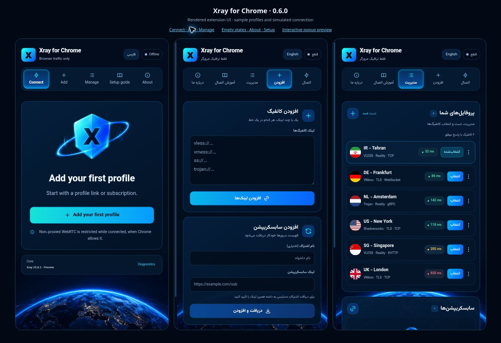

# Xray for Chrome

**مدیریت اتصال Xray در Google Chrome با رابط فارسی و انگلیسی، برای Windows و macOS**

نسخه افزونه و بسته: **0.7.4** — رابط نئون آبی

[دریافت نسخه‌ها](https://github.com/pesarakloo/xray-for-chrome/releases) · [گزارش مشکل](https://github.com/pesarakloo/xray-for-chrome/issues) · [وب‌سایت آنی‌سافت](https://anisoft.ir) · [کانال تلگرام](https://t.me/xray_chrome)

## ظاهر جدید در نسخه 0.7.4

بازطراحی هر پنج تب بر اساس اسکرین‌های مرجع: زمینه سرمه‌ای، نور آبی، سپر سه‌بعدی، کره زمین، کارت‌های کانفیگ و فونت محلی وزیرمتن. رابط فارسی و انگلیسی، جهت RTL/LTR و اندازه پنجره Chrome حفظ شده‌اند.



این بسته **نسخه کامل گیت‌هاب** است؛ بسته جدید Chrome Web Store در این مرحله آماده نشده است. فایل‌های برنامه مکمل همان نسخه سازگار 0.7.4 هستند و این بازطراحی به نصب مجدد آن‌ها نیاز ندارد.

## معرفی

Xray for Chrome امکان افزودن لینک کانفیگ، دریافت فهرست سرورها از سابسکریپشن، اندازه‌گیری زمان پاسخ و مدیریت اتصال را از داخل مرورگر فراهم می‌کند.

این پروژه از دو بخش تشکیل شده است: **افزونه Chrome** برای مدیریت کانفیگ‌ها و تنظیم پراکسی مرورگر، و **برنامه مکمل** برای اجرای هسته Xray روی دستگاه. ارتباط این دو بخش از طریق Native Messaging انجام می‌شود.

برای استفاده، به افزونه، برنامه مکمل و یک کانفیگ معتبر یا لینک اشتراک نیاز دارید. سرور و اشتراک همراه پروژه ارائه نمی‌شود.

پراکسی روی پروفایل عادی Chrome اعمال می‌شود. تنظیمات پراکسی سیستم‌عامل تغییر نمی‌کند و برنامه‌های دیگر و حالت Incognito تحت پوشش این نسخه نیستند.

## امکانات

- فارسی پیش‌فرض و دکمه تغییر فوری به English؛ زبان انتخابی ذخیره می‌شود
- رابط دوزبانه با تب‌های «اتصال»، «افزودن»، «مدیریت»، «آموزش اتصال» و «درباره ما»
- افزودن یک یا چند لینک کانفیگ، هر کدام در یک خط
- افزودن، به‌روزرسانی دستی و حذف سابسکریپشن
- انتخاب کانفیگ و اتصال یا قطع اتصال از داخل افزونه
- نمایش زمان پاسخ در صفحه اتصال، منوی انتخاب و فهرست کانفیگ‌ها
- پینگ HTTPS تکی و گروهی از مسیر خود کانفیگ، با حداکثر دو تست هم‌زمان و امکان توقف صف
- تست با Xray موقت و پورت محلی جدا، بدون تغییر اتصال فعال
- کارت‌های کانفیگ با پینگ خوانا، انتخاب سرور و منوی سه‌نقطه برای تست و حذف؛ اسکرول یکپارچه صفحه
- ذخیره کانفیگ‌ها، اشتراک‌ها و نتایج تست در دستگاه
- نمایش وضعیت هسته و گزارش خطا
- راهنمای نصب و اتصال Windows و macOS با دکمه کپی دستورها
- اجرای SOCKS5 محلی روی `127.0.0.1:10808`
- محدودکردن UDP غیرپراکسی WebRTC هنگام اتصال، در صورت اجازه تنظیمات Chrome
- نصب برنامه مکمل در حساب کاربری، بدون نیاز معمول به دسترسی Administrator یا `sudo`

## پروتکل‌ها و فرمت‌های ورودی

| پروتکل | قالب لینک | وضعیت در نسخه 0.7.4 |
| --- | --- | --- |
| VLESS | `vless://` | ورود لینک و تولید تنظیمات اتصال |
| VMess AEAD | `vmess://` | لینک Base64 از JSON؛ فقط `alterId = 0` |
| Shadowsocks | `ss://` | ورود لینک و تولید تنظیمات اتصال؛ روش رمزنگاری باید در هسته نصب‌شده پشتیبانی شود |
| Trojan | `trojan://` | ورود لینک پیاده‌سازی شده است؛ سازگاری اتصال با هسته این بسته هنوز تأیید نشده است |

**شناخته‌شدن لینک به معنی تأیید همه ترکیب‌های پروتکل، انتقال و رمزنگاری نیست.** تنظیمات باید با سرور و نسخه هسته Xray سازگار باشند. در این نسخه، ساختار خروجی VLESS، VMess و Shadowsocks اصلاح شده است؛ ساختار خروجی Trojan نیازمند بررسی جداگانه است.

### روش‌های انتقال

| روش انتقال | نام‌های قابل تشخیص در لینک |
| --- | --- |
| RAW / TCP | `raw`، `tcp` |
| WebSocket | `ws`، `websocket` |
| gRPC | `grpc`، `gun` |
| HTTPUpgrade | `httpupgrade`، `http-upgrade` |
| XHTTP | `xhttp`، `splithttp` |
| mKCP | `kcp`، `mkcp` |

مقادیر قدیمی `http` و `h2` در ورودی به XHTTP نگاشت می‌شوند؛ این رفتار به معنی پشتیبانی مستقل از انتقال قدیمی HTTP/2 نیست.

پارامترهای TLS و REALITY، مقدارهای SNI، ALPN و fingerprint و تنظیماتی مانند path، host، serviceName و XHTTP extra در Parser پردازش می‌شوند. سازگاری تمام قابلیت‌های پیشرفته، از جمله REALITY، FinalMask و mKCP، با همه نسخه‌های هسته تأیید نشده است.

از پلاگین‌های Shadowsocks، فقط `obfs-local;obfs=http` به تنظیمات RAW HTTP تبدیل می‌شود. `v2ray-plugin` پشتیبانی نمی‌شود.

### سابسکریپشن

محتوای سابسکریپشن باید یکی از این دو حالت باشد:

- فهرست لینک‌ها به صورت متن ساده، هر کانفیگ در یک خط
- نسخه Base64 همان فهرست

فایل‌های Clash YAML و sing-box JSON قابل واردکردن نیستند. دریافت اولیه هنگام افزودن اشتراک انجام می‌شود؛ برای دریافت تغییرات بعدی، از دکمه به‌روزرسانی در تب «مدیریت» استفاده کنید.

## پیش‌نیازها

| مورد | Windows | macOS |
| --- | --- | --- |
| سیستم‌عامل هدف | Windows 10 یا 11 | macOS 12 یا جدیدتر |
| مرورگر | Google Chrome 116 یا جدیدتر | Google Chrome 116 یا جدیدتر |
| ابزار لازم | Windows PowerShell 5.1 و .NET Framework 4.8 | ابزارهای داخلی سیستم |
| برنامه مکمل | پوشه `native-hosts/windows` | پوشه `native-hosts/macos` |

برای نصب معمول، اینترنت و دسترسی به GitHub لازم است. با فایل محلی هسته نیز می‌توان نصب کرد. نصب macOS به Xcode، Swift، Python یا Command Line Tools نیاز ندارد. برای Linux، Android و iOS نصب‌کننده‌ای در این بسته وجود ندارد.

## ۱. دریافت فایل‌ها

1. صفحه [Releases](https://github.com/pesarakloo/xray-for-chrome/releases) را باز کنید و بسته کامل نسخه موردنظر را دریافت کنید. اگر بسته انتشار در دسترس نیست، از صفحه مخزن گزینه **Code → Download ZIP** را انتخاب کنید.
2. فایل ZIP را کامل استخراج کنید.
3. وارد پوشه‌ای شوید که `extension` و `native-hosts` داخل آن هستند. این پوشه در ادامه «پوشه اصلی پروژه» نامیده می‌شود.
4. فایل‌های هر نصب‌کننده را کنار هم نگه دارید؛ دریافت فقط `install.ps1` یا فقط پوشه `extension` برای نصب برنامه مکمل کافی نیست.

## ۲. نصب برنامه مکمل در Windows

اگر متصل هستید، ابتدا «قطع اتصال» را بزنید و سپس Chrome را کاملاً ببندید.

پوشه اصلی پروژه را در File Explorer باز کنید. در نوار آدرس عبارت `powershell` را بنویسید و Enter بزنید. سپس اجرا کنید:

```powershell
.\install-windows.cmd
```

نصب‌کننده برنامه مکمل را می‌سازد، هسته Xray را آماده می‌کند و ارتباط Native Messaging را برای حساب کاربری فعلی ثبت می‌کند. پس از پیام `Installation completed successfully`، Chrome را دوباره باز کنید.

می‌توانید برای نسخه دستی، `install-windows.cmd` را دوبار کلیک کنید. این راه‌انداز تنها `install.ps1` همین بسته را با `Unblock-File` از مسدودی دانلود خارج می‌کند. تنظیم دائمی ExecutionPolicy یا آنتی‌ویروس تغییر نمی‌کند. برای دستگاه با سیاست سازمانی یا الزام امضای معتبر، باید از مدیر سیستم یا نصب‌کننده دارای امضای مورد اعتماد کمک گرفت. بسته فعلی امضای معتبر Authenticode ندارد و حذف همه هشدارهای Windows تضمین نمی‌شود.

**نسخه Chrome Web Store:** ابتدا افزونه را نصب و تب آموزش را باز کنید؛ دستور Windows را از آنجا کپی کنید. دستور شامل `-ExtensionId` با شناسه واقعی همان نسخه است. دستور بدون این گزینه برای شناسه ثابت نسخه دستی است.

### نسخه هسته و نصب مجدد

دانلود خودکار Windows در این بسته روی **Xray v25.8.3** تنظیم شده است. در نصب مجدد عادی، اگر هسته‌ای از قبل نصب باشد و فایل محلی یا همراه بسته جایگزین آن نشود، همان هسته حفظ می‌شود.

برای دانلود مجدد نسخه تعیین‌شده:

```powershell
.\install-windows.cmd -ForceDownload
```

برای نصب برنامه مکمل با هسته موجود، بدون دانلود:

```powershell
.\install-windows.cmd -SkipDownload
```

اگر هسته موجود یا فایل همراه بسته پیدا نشود، `-SkipDownload` خطا می‌دهد. این گزینه برای نصب تازه بدون هسته کافی نیست.

### نصب با فایل محلی یا اینترنت کند

فایل رسمی Xray متناسب با Windows و معماری دستگاه را از [انتشارهای Xray-core](https://github.com/XTLS/Xray-core/releases) دریافت و استخراج کنید. مسیر واقعی فایل را جایگزین نمونه کنید:

```powershell
.\install-windows.cmd -XrayExe "C:\Path\To\xray.exe"
```

مهلت پیش‌فرض دریافت اطلاعات انتشار ۳۰ ثانیه و دانلود ۱۸۰ ثانیه است. برای اتصال کند می‌توانید آن‌ها را افزایش دهید:

```powershell
.\install-windows.cmd -MetadataTimeoutSec 60 -DownloadTimeoutSec 600
```

گزینه `-ForceDownload` را هم‌زمان با `-SkipDownload` یا `-XrayExe` استفاده نکنید.

## ۳. نصب برنامه مکمل در macOS

اگر متصل هستید، ابتدا اتصال را قطع کنید و با **⌘ Q** از Chrome خارج شوید.

برای نسخه استور، دستور آماده را از تب آموزش همان افزونه کپی کنید؛ این دستور `--extension-id` را دارد. برای نسخه دستی، Terminal را باز کنید، با دستور `cd` وارد پوشه اصلی پروژه شوید و اجرا کنید:

```bash
/bin/zsh ./native-hosts/macos/install.command
```

اجرای مستقیم اسکریپت با `/bin/zsh` به تغییر مجوز اجرای فایل دانلودشده نیاز ندارد. نصب‌کننده معماری Mac را خودکار تشخیص می‌دهد:

- **Apple Silicon:** بسته `Xray-macos-arm64-v8a.zip`
- **Intel:** بسته `Xray-macos-64.zip`

پس از پیام پایان نصب، Chrome را دوباره باز کنید.

### انتخاب نسخه یا فایل محلی

نصب‌کننده macOS از فهرست انتشارهای رسمی Xray، جدیدترین مورد دارای فایل مناسب را انتخاب می‌کند و در حالت پیش‌فرض می‌تواند نسخه پیش‌انتشار را نیز انتخاب کند. برای محدودکردن انتخاب به نسخه‌های پایدار:

```bash
/bin/zsh ./native-hosts/macos/install.command --stable-only
```

برای استفاده از فایل رسمی که قبلاً دانلود و استخراج کرده‌اید:

```bash
/bin/zsh ./native-hosts/macos/install.command --xray "/path/to/xray"
```

در macOS، اجرای مجدد نصب‌کننده بدون `--xray` هسته را دوباره دریافت می‌کند. رفتار انتخاب نسخه آن با نصب‌کننده Windows یکسان نیست.

## ۴. افزودن افزونه به Chrome

این مراحل برای بارگذاری دستی نسخه GitHub در هر دو سیستم‌عامل است:

1. در نوار آدرس Chrome، `chrome://extensions` را وارد کنید.
2. **Developer mode** را روشن کنید.
3. روی **Load unpacked** بزنید.
4. فقط پوشه **`extension`** را انتخاب کنید؛ فایل `manifest.json` باید مستقیماً داخل همین پوشه باشد.
5. از منوی افزونه‌ها، Xray for Chrome را به نوار ابزار سنجاق کنید.
6. افزونه را باز کنید و وضعیت «موتور» را بررسی کنید.

پوشه افزونه را پس از بارگذاری حذف یا جابه‌جا نکنید.

شناسه ثابت نسخه بارگذاری‌شده از این بسته:

```text
kcefgbldpcaoicjpdcmilahhlcbcflpj
```

شناسه بالا برای نسخه دستی است. برای حفظ داده‌های همین نسخه، مقدار `key` را تغییر ندهید. نسخه استور ممکن است شناسه متفاوت داشته باشد؛ دستور آموزش افزونه شناسه واقعی را با `-ExtensionId` در Windows و `--extension-id` در macOS به نصب‌کننده می‌دهد. داده‌های دو شناسه به‌صورت خودکار منتقل نمی‌شوند؛ لینک‌ها و اشتراک‌ها را در نسخه استور دوباره وارد کنید و قبل از انتقال، نسخه قبلی را حذف نکنید.

نصب افزونه از Chrome Web Store به Developer mode نیاز ندارد، اما برنامه مکمل همچنان جداگانه نصب می‌شود. لینک نصب استور باید از صفحه رسمی پروژه دریافت شود.

## ۵. افزودن کانفیگ و اتصال

### ورود دستی

1. تب «افزودن» را باز کنید.
2. یک یا چند لینک را در بخش «افزودن کانفیگ» قرار دهید؛ هر لینک در یک خط.
3. روی «افزودن لینک‌ها» بزنید.
4. در تب «اتصال»، کانفیگ را انتخاب کنید.
5. در صورت نیاز «تست پینگ» را اجرا کنید و سپس «اتصال» را بزنید.

### استفاده از سابسکریپشن

1. در تب «افزودن»، به بخش «افزودن سابسکریپشن» بروید.
2. نام دلخواه و لینک مستقیم **HTTPS بدون تغییر مسیر** را وارد کنید. لینک HTTP از این نسخه پذیرفته نمی‌شود؛ از ارائه‌دهنده لینک HTTPS بگیرید.
3. روی «دریافت و افزودن» بزنید و دسترسی به دامنه همان اشتراک را تأیید کنید.
4. پس از دریافت فهرست، کانفیگ دلخواه را در تب «اتصال» انتخاب کنید.

در تب «مدیریت» می‌توانید کانفیگ‌ها و سابسکریپشن‌ها را مدیریت کنید. نشانی سابسکریپشن ممکن است حاوی توکن دسترسی باشد؛ آن را در گزارش عمومی منتشر نکنید.

برای پایان استفاده، «قطع اتصال» را بزنید. افزونه تنظیم پراکسی و محدودیت WebRTC اعمال‌شده توسط خودش را پاک می‌کند و هسته مربوط به اتصال را متوقف می‌کند.

## پینگ چگونه محاسبه می‌شود؟

در نسخه **0.7.4**، روش HTTPS نسخه 0.4.1 حفظ شده است: زمان پاسخ یک درخواست **HTTPS از مسیر خود کانفیگ** به `https://www.gstatic.com/generate_204` اندازه‌گیری می‌شود. پاسخ معتبر `204` موفق محسوب می‌شود. این تست TCP یا ICMP نیست.

- برای هر کانفیگ، یک Xray موقت با تنظیمات همان کانفیگ و پورت Loopback جدا اجرا می‌شود؛ اتصال فعال و پراکسی مرورگر تغییر نمی‌کنند.
- مانند روش قبلی، حداکثر **دو تست هم‌زمان** اجرا می‌شود تا اجرای تعداد زیادی هسته Xray به دستگاه فشار نیاورد.
- زمان نمایش‌داده‌شده، زمان درخواست HTTPS است؛ آماده‌سازی هسته جزو عدد پینگ نیست. مهلت درخواست **۸ ثانیه** است و آماده‌شدن هسته زمان جداگانه‌ای دارد.
- کانفیگ‌ها حتی با آدرس و پورت یکسان جداگانه آزمایش می‌شوند؛ زیرا اطلاعات ورود، TLS و روش انتقال می‌توانند متفاوت باشند.
- «توقف تست» صف را لغو می‌کند؛ تست‌های جاری در مهلت خود پایان می‌یابند و نتیجه‌های کامل‌شده حفظ می‌شوند.
- نتیجه‌های ثبت‌نشده یا قدیمی‌تر از **۵ دقیقه**، هنگام بازکردن افزونه یا افزودن کانفیگ دوباره تست می‌شوند.
- اعداد TCP ذخیره‌شده در نسخه 0.4.0 در این نسخه نمایش داده نمی‌شوند و با نتیجه HTTPS جایگزین خواهند شد.
- وضعیت هر ردیف مشخص می‌کند کانفیگ در انتظار تست، در حال تست، دارای پاسخ، بی‌پاسخ یا دارای خطاست.

موفقیت این تست نشان می‌دهد درخواست HTTPS به مقصد آزمایش از مسیر کانفیگ پاسخ گرفته است؛ دسترسی به تمام سایت‌ها را تضمین نمی‌کند. «بی‌پاسخ» نیز ممکن است از محدودیت شبکه یا مقصد آزمایش ناشی شود.

برنامه مکمل 0.4.0 نیز از HTTPS پشتیبانی می‌کند. این بسته برنامه مکمل 0.7.4 با همان منطق پینگ دارد؛ برای ثبت شناسه نسخه استور، نصب‌کننده جدید را از دستور تب آموزش اجرا کنید.

## به‌روزرسانی

1. اتصال را قطع کنید.
2. نسخه جدید را کامل دریافت و استخراج کنید.
3. فایل‌های افزونه را در همان مسیر قبلی جایگزین کنید.
4. نصب‌کننده برنامه مکمل همین بسته را از دستور تب آموزش اجرا کنید؛ به‌ویژه برای نسخه استور باید شناسه واقعی ثبت شود. هسته موجود Windows در نصب عادی حفظ می‌شود.
5. Chrome را دوباره باز کنید و در `chrome://extensions` روی **Reload** بزنید.

برای به‌روزرسانی نیازی به حذف افزونه نیست. حفظ مسیر، شناسه و پروفایل Chrome به حفظ داده‌های ذخیره‌شده کمک می‌کند. حذف افزونه ممکن است کانفیگ‌ها و اشتراک‌های محلی را پاک کند.

تغییرات هر نسخه در [CHANGELOG.md](CHANGELOG.md) ثبت شده‌اند.

## رفع خطاهای رایج

| مشکل | اقدام پیشنهادی |
| --- | --- |
| `manifest.json` پیدا نمی‌شود | ZIP را استخراج کنید و در Load unpacked فقط پوشه `extension` را انتخاب کنید. |
| برنامه مکمل پیدا نمی‌شود | نصب‌کننده را برای همان حساب کاربری اجرا کنید، Chrome را کاملاً ببندید و دوباره باز کنید؛ شناسه افزونه را هم بررسی کنید. |
| نصب Windows روی دریافت Xray می‌ماند | دسترسی به GitHub را بررسی کنید. نصب‌کننده جدید مهلت دریافت و دانلود دارد؛ در صورت نیاز از `-XrayExe` استفاده کنید. |
| فایل `XrayChromeHost.cs` پیدا نمی‌شود | بسته را کامل استخراج کنید؛ این فایل باید کنار `install.ps1` باشد. |
| کامپایلر .NET پیدا نمی‌شود | وجود .NET Framework 4.8 و ابزار کامپایل آن را بررسی کنید. |
| هسته کانفیگ را رد می‌کند | «گزارش خطا» را باز کنید و پروتکل، نوع انتقال، اطلاعات سرور و نسخه Xray را بررسی کنید. |
| پراکسی توسط افزونه دیگری کنترل می‌شود | افزونه‌های دیگرِ کنترل پراکسی را موقتاً غیرفعال کنید و دوباره اتصال را بزنید. |
| VMess متصل نمی‌شود | ساعت و تاریخ سیستم را تنظیم کنید و مطمئن شوید کانفیگ AEAD با `alterId = 0` است. |
| سابسکریپشن وارد نمی‌شود | نشانی و اعتبار اشتراک را بررسی کنید؛ محتوا باید فهرست لینک یا Base64 آن باشد. |
| پس از ارتقا تست پینگ کار نمی‌کند | برنامه مکمل بسته جدید را دوباره نصب کنید و افزونه را Reload کنید. |
| پینگ موفق است ولی سایتی باز نمی‌شود | پینگ موفق، دسترسی به مقصد آزمایش را نشان می‌دهد؛ دسترسی سرور به سایت موردنظر و گزارش خطا را بررسی کنید. |

## حریم خصوصی و دسترسی‌ها

کانفیگ‌ها، لینک‌های اشتراک و نتایج تست در `chrome.storage.local` نگه‌داری می‌شوند. کانفیگ فعال نیز برای اجرای هسته در پوشه runtime برنامه مکمل نوشته می‌شود. این داده‌ها می‌توانند شامل رمز یا شناسه اتصال باشند و نباید فایل رمزگذاری‌شده فرض شوند.

در کد این بسته سامانه‌ای برای ارسال آمار استفاده به سازنده وجود ندارد. با این حال، دریافت سابسکریپشن با سرور ارائه‌دهنده، پینگ HTTPS از مسیر کانفیگ با مقصد gstatic و دانلود هسته با GitHub ارتباط شبکه‌ای برقرار می‌کنند. برای تست HTTPS، تنظیمات همان کانفیگ به برنامه مکمل فرستاده می‌شود و هسته موقت از آن برای اتصال به سرور شما استفاده می‌کند. ترافیک پراکسی‌شده نیز از سرور انتخابی شما عبور می‌کند.

| مجوز | کاربرد |
| --- | --- |
| `nativeMessaging` | ارتباط با برنامه مکمل روی دستگاه |
| `proxy` | تنظیم و پاک‌کردن پراکسی Chrome |
| `storage` | ذخیره کانفیگ‌ها، اشتراک‌ها و وضعیت محلی |
| `privacy` | درخواست محدودسازی WebRTC غیرپراکسی هنگام اتصال |
| دسترسی اختیاری HTTPS | دریافت اشتراک، فقط پس از تأیید کاربر برای دامنه همان لینک |

هسته روی `127.0.0.1` گوش می‌دهد. آدرس‌های loopback و نام‌های محلیِ مستثناشده از پراکسی عبور نمی‌کنند. این نسخه قابلیت Kill Switch سراسری ندارد و پوشش همه ترافیک دستگاه را فراهم نمی‌کند.

## مسیر نصب و حذف

| سیستم‌عامل | پوشه برنامه مکمل |
| --- | --- |
| Windows | `%LOCALAPPDATA%\XrayChrome` |
| macOS | `~/Library/Application Support/XrayChrome` |

پوشه `runtime` شامل وضعیت و کانفیگ اجرا و پوشه `logs` شامل گزارش‌های هسته است. نام Native Host برابر `com.anicloud.xray_chrome` است.

برای حذف، ابتدا اتصال را قطع کنید و Chrome را ببندید. از پوشه اصلی پروژه دستور مناسب را اجرا کنید.

**Windows:**

```powershell
.\uninstall-windows.cmd
```

راه‌انداز حذف فقط `uninstall.ps1` همین بسته را رفع مسدودی می‌کند؛ اسکریپت حذف را مستقیماً اجرا نکنید، مگر آن را بررسی و جداگانه Unblock کرده باشید.

**macOS:**

```bash
/bin/zsh ./native-hosts/macos/uninstall.command
```

سپس افزونه را از `chrome://extensions` حذف کنید. حذف برنامه مکمل و حذف افزونه دو مرحله جدا هستند.

## ساختار پروژه

| مسیر | محتوا |
| --- | --- |
| `extension/` | افزونه مشترک Chrome با Manifest V3 |
| `extension/popup/` | رابط کاربری و راهنمای اتصال |
| `extension/modules/` | پردازش لینک، تولید کانفیگ، ذخیره‌سازی و تست زمان پاسخ |
| `native-hosts/windows/` | برنامه مکمل و اسکریپت‌های Windows |
| `native-hosts/macos/` | برنامه مکمل و اسکریپت‌های macOS |
| `tests/` | تست‌های موجود پروژه |
| `CHANGELOG.md` | تاریخچه تغییرات |

## بررسی کد

تست‌های JavaScript به Node.js نیاز دارند؛ نصب وابستگی برای اجرای آن‌ها لازم نیست:

```bash
npm test
npm run check
```

این تست‌ها شامل Parser، ساخت کانفیگ، ذخیره‌سازی، مدیریت تست گروهی HTTPS، جداسازی نتایج TCP قدیمی، توقف و خطاهای Native Messaging هستند. آزمون اختیاری قابلیت TCP باقی‌مانده در برنامه مکمل مک (برای سازگاری با نسخه 0.4.0) با `npm run test:mac-helper` به Python 3 و zsh نیاز دارد؛ این ابزارها فقط برای آزمون توسعه‌دهنده‌اند و نیاز نصب افزونه محسوب نمی‌شوند. این آزمون از اتصال محلی واقعی و جایگزین‌های آزمایشی `nc` و `osascript` استفاده می‌کند و جای تست روی macOS را نمی‌گیرد.

تست‌های خودکار، تأیید اتصال واقعی همه پروتکل‌ها یا تأیید انتشار در Chrome Web Store نیستند. نصب و اتصال نهایی باید روی Windows و macOS با کانفیگ معتبر بررسی شود.

## ارتباط و گزارش مشکل

- وب‌سایت: [anisoft.ir](https://anisoft.ir)
- مخزن پروژه: [pesarakloo/xray-for-chrome](https://github.com/pesarakloo/xray-for-chrome)
- کانال تلگرام: [t.me/xray_chrome](https://t.me/xray_chrome)
- ثبت مشکل: [GitHub Issues](https://github.com/pesarakloo/xray-for-chrome/issues)

در گزارش مشکل، نسخه افزونه و هسته، سیستم‌عامل، نوع پروتکل و متن خطا را بنویسید. پیش از انتشار گزارش، رمز، UUID، توکن اشتراک و دیگر اطلاعات خصوصی کانفیگ را حذف کنید.

این پروژه برای اجرای اتصال از [XTLS/Xray-core](https://github.com/XTLS/Xray-core) استفاده می‌کند. راهنمای بارگذاری دستی افزونه در [مستندات رسمی Chrome](https://developer.chrome.com/docs/extensions/get-started/tutorial/hello-world#load-unpacked) نیز در دسترس است.


## انتشار Chrome Web Store

این تحویل برای گیت‌هاب است و بسته جدید استور ندارد. نوشته‌های `store/` به پیش‌نویس 0.7.4 تعلق دارند؛ برای ارسال بعدی باید توضیحات، تصاویر واقعی رابط، مجوزها و افشای داده‌ها جداگانه بازبینی شوند. بسته قدیمی تولیدشده از این خروجی حذف شده تا اشتباهاً بارگذاری نشود. ابزار `npm run release` برای مرحله آماده‌سازی استور باقی مانده است.

## پیش‌نمایش رابط برای توسعه

با Node.js 22 یا بالاتر و بدون نصب وابستگی:

```sh
npm run dev
```

صفحه محلی روی پورت 4173 رابط واقعی افزونه را با داده‌های نمونه باز می‌کند. اتصال و پینگ در این پیش‌نمایش شبیه‌سازی می‌شوند و هیچ پراکسی‌ای اجرا نمی‌شود. فایل‌های `tools/preview/` بیرون پوشه افزونه هستند و در اجرای واقعی یا بسته استور بارگذاری نمی‌شوند.

```sh
npm test
npm run check
```

پرچم‌ها صرفاً از کد کشور یا پرچم موجود در نام کانفیگ نمایش داده می‌شوند؛ برای موقعیت‌یابی سرور درخواست شبکه‌ای انجام نمی‌شود. مجوز منابع رابط در `THIRD-PARTY-NOTICES.md` آمده است.
